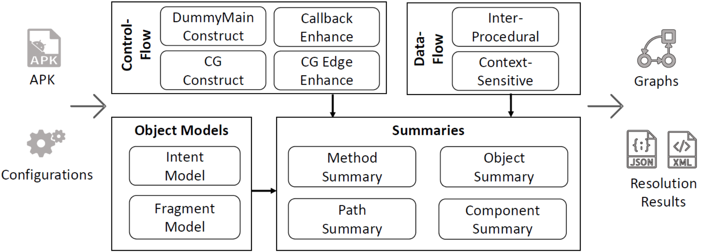

# ICCBot

ICCBot: A Fragment-Aware and Context-Sensitive ICC Resolution Tool for Android Applications.

<p align="center">

</p>

## Publication ##
The paper PDF can be found at https://hanada31.github.io/pdf/icse22_iccbot.pdf
```
@inproceedings{icse22_iccbot,
  author    = {Jiwei Yan and
               Shixin Zhang and
	       Yepang Liu and
               Jun Yan and
               Jian Zhang},
  title     = {ICCBot: Fragment-Aware and Context-Sensitive ICC Resolution for {Android} Applications},
  booktitle = {The 44th International Conference on Software Engineering, {ICSE} 2022 (Demo Track)},
  year      = {2022},
}

```

Requirements：

1. Python 3+

2. Java 1.8+

3. Install GraphViz (http://www.graphviz.org/download/) 


build and run *ICCBot* to analyze single apk: : 
```
mvn -f pom.xml clean package

cp target/ICCBot.jar ICCBot.jar

java -jar ICCBot.jar  -path apk// -name ICCBotBench.apk -androidJar lib//platforms -time 30 -maxPathNumber 100 -client CTGClient -outputDir results//output
```
or analyze apks under given folder with Python script:

```
python .\scripts\runICCBot.py [apkPath] [resultPath]
```


Usage of ICCBot.jar:

```
java -jar ICCBot.jar -h

usage: java -jar ICCBot.jar [options] [-path] [-name] [-androidJar] [-outputDir][-client]
 
 -h                     -h: Show the help information.
 -name <arg>            -name: Set the name of the apk under analysis.
 -path <arg>            -path: Set the path to the apk under analysis.
 -outputDir <arg>       -outputDir: Set the output folder of the apk.
 -client <arg>          -client 
                         "CallGraphClient: Output call graph files."
                         "ManifestClient: Output manifest.xml file."
                         "IROutputClient: Output soot IR files."
                         "FragmentClient: Output the fragment loading results."
                         "CTGClient/MainClient: Resolve ICC and generate CTG."
                         "ICCSpecClient:  Report ICC specification for each component."
                        
 -androidJar <arg>      -androidJar: Set the path of android.jar.                
 -version <arg>         -version [default:23]: Version of Android SDK.
 -maxPathNumber <arg>   -maxPathNumber [default:10000]: Set the max number of paths.
 -time <arg>            -time [default:90]: Set the max running time (min).

 -noAdapter             -noAdapter: exclude super simple adapter model
 -noAsyncMethod         -noAsyncMethod: exclude async method call edge
 -noCallBackEntry       -noCallBackEntry: exclude the call back methods
 -noDynamicBC           -noDynamicBC: exclude dynamic broadcast receiver matching
 -noFragment            -noFragment: exclude fragment operation model
 -noFunctionExpand      -noFunctionExpand: do not inline function with useful contexts
 -noImplicit            -noImplicit: exclude implict matching
 -noLibCode             -noLibCode: exclude the activities not declared in app's package
 -noPolym               -noPolym: exclude polymorphism methods
 -noStaticField         -noStaticField: exclude string operation model
 -noStringOp            -noStringOp: exclude string operation model
 -noWrapperAPI          -noWrapperAPI: exclude RAICC model
 -onlyDummyMain         -onlyDummyMain: limit the entry scope

 -debug                 -debug: use debug mode.
```


Input: apk File

Output: ICC resolution results, CTG graph, etc.

+ CallGraphInfo
  + Generated extended call graph
+ ManifestInfo
  + Extracted AndroidManifest file
+ FragmentInfo
  + Generated fragment loading graph
+ CTGResult
  + Generated component transition graph
+ ICCSpecification
  + Generated ICC specification json file
+ SootIRInfo
  + Generated Soot Jimple IR files 
